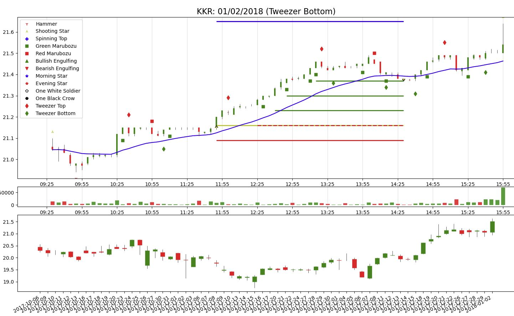

# Lightning-Fast Indicators

## Accesses Candles Through the Alpaca Market Data API and Calculates Technical Indicators.

You can retrieve years of historical data for over 6000 symbols with one click of a button without fear of overwhelming your RAM. These modules were written to create neatly formatted data files to use when backtesting day trading strategies. 
- dataprocessor.py: Imports intraday data and calculates indicators before saving to two .Feather files. 
  - One file contains data for all symbols for one month (each month has a separate file). The other file contains the start and end indices of each symbol in the first file.
- dailyprocessor.py: Imports daily data and calculates indicators before saving to two .Feather files. 
  - One file contains data for entire time period. The other file contains the start and end indices of each symbol in the first file.

- candlesticks.py: Produces candlestick plots including functionality for adding technical indicators.

**Be sure to check out the Wiki for implementation and performance details!**


## Getting Started

1) Clone this repository.
2) Download all required libraries using pip install.
3) Make an account with Alpaca (go to Alpaca.markets).
4) Import intraday data using dataprocessor.py and daily data with dailyprocessor.py.

**Data Retrieval and Indicator Calculation:**

1) Specify user parameters in dataprocessor.py / dailyprocessor.py:
    - API key: *line 28* / *line 30*
    - Secret key: *line 29* / *line 31*
    - Place to save files: *line 30* / *line 32*
2) Specify data parameters in dataprocessor.py / dailyprocessor.py:
    - start_date: *line 1454* / *line 788* (YYYY, MM, dd) 
    - end_date: *line 1455* / *line 789*
    - timeframe: *line 1456*, e.g. '5min' (only applicable for dataprocessor.py).
    - symbols: *line 1458* / *line 791* - ['AAPL', 'SPY'] (set to import 1602 symbols found in CSV file by default).
3) Click run.

**Accessing Data in Your Script:**

1) Read the two .Feather files using:

```
intraday_path = """<your filepath>\\YYYY_MM_5min.feather"""
daily_path = """<your filepath>\\daily.feather"""

data_file = pd.read_feather(<intraday or daily path>)
index_file = pd.read_feather("""<intraday or daily path>_indices.feather""")
```
2) Get the start and end indices of your desired symbol (AAPL example):
```
aapl_index = np.where(index_file['symbol'] == 'AAPL')[0][0]
start_index = index_file['start'][aapl_index]
end_index = index_file['end'][aapl_index]
```
 3) Put symbol data in a dictionary:
```
aapl_dict = {header: data_file[header][start_index:end_index].to_numpy() for header in data_file.columns}
```
4) Use dictionary keys from tables below to access Numpy array for each query:
```
close_price = aapl_dict['close']
open_price = aapl_dict['open']
ema_20 = aapl_dict['20 EMA']
...
```
**Market Data with Associated Dictionary Key:**

|Name| Dictionary Key|
|---|---|
|Open| 'open'|
|High| 'high'|
|Low| 'low'|
|Close| 'close'|
|Volume| 'volume'|
|Timestamp 1*| 'time'|
|Timestamp 2**| 'integer time'/'integer day'|

\* Timestamp represented as a datetime.datetime object. \
\** Integer representation of timestamp. Intraday set's key follows one for daily set. No hour and minute values for daily bars. (YYYYMMddHHmm without hyphens or colons)

**Intraday Indicators with Associated Dictionary Key:**

<table>
<tr><th> Continuous Indicators </th><th> Candlestick Patterns </th></tr>
<tr><td>

| Indicator | Dictionary Key |
|-----------|----|
|9 EMA | '9 EMA'|
|20 EMA | '20 EMA'|
|50 EMA | '50 EMA'|
|200 EMA| '200 EMA'|
|MACD | 'MACD'|
|Signal| 'signal'|
|RSI| 'RSI'|
|ATR| 'ATR'|
|VWAP| 'VWAP'|
|Bollinger Band (upper)| 'Bollinger (Upper)'|
|Bollinger Band (lower)| 'Bollinger (Lower)'|
|Consecutives*| 'Consecutives'|
|Tenkan (Conversion) Line**| 'Tenkan'|
|Kijun (Base) Line**| 'Kijun'|
|Senkou (Leading) Span A**| 'Senkou Span A'|
|Senkou (Leading) Span B**| 'Senkou Span B'|

</td><td>

| Indicator | Dictionary Key |
|-----------|----|
|Hammer| 'Hammer'|
|Shooting Star| 'Shooting Star'|
|Spinning Top| 'Spinning Top'|
|Green Marubozu| 'Green Marubozu'|
|Red Marubozu| 'Red Marubozu'|
|Bullish Engulfing| 'Bullish Engulfing'|
|Bearish Engulfing| 'Bearish Engulfing'|
|Evening Star Reversal| 'Evening Star'|
|Morning Star Reversal| 'Morning Star'|
|Tweezer Top| 'Tweezer Top'|
|Tweezer Bottom| 'Tweezer Bottom'|

</td></tr> </table>

\* Number of consecutive candles of the same color (positive and negative values for bullish and bearish candles respectively). \
\** Part of the Ichimoku Cloud Indicator.

**Daily Indicators with Associated Dictionary Key:**

|Indicator| Dictionary Key|
|---|---|
|200 EMA| '200 EMA'|
|ATR| 'ATR'|
|Overnight Gap Percentage* | 'gap percentage'|
|Previous Day** | 'previous day'|
|Support/Resistance Values***| 'SR'|
|Support/Resistance Indices|'SR indices'|

\* Percent difference between the previous day's close price and the current open price. \
\** TRUE if previous day is bullish (closes above open), FALSE if previous day is bearish or a doji. \
\*** A list of values that correspond to support and resistance levels. 'SR indices' refers to the index (in the past) during which the price reached such level.

**Plotting Candlestick Charts with candlesticks.py:**

Plots one day of data. Candlesticks containing prices and volume bars are automatically plotted.

1) Import candlsticks.py
2) Pass the parameters to create instance of CandleGraph:
    - Symbol name.
    - Data for one symbol: aapl_dict variable from above.
    - Timeframe.
    - Any index found in the day of interest.
    - Trade information: to show entry, exit, stoploss values/bars (optional)
3) Call the following methods to plot indicators:

|| Instance Methods | |
|------|-----|--------|
|plot_EMA(n)| plot_RSI()| plot_MACD()|
|plot_VWAP()| plot_bollinger()| plot_pattern()|

## Example Candlestick Plots

**Typical Plot with EMA and MACD Displayed (5 min timeframe)**


**Trade Made by a Hypothetical Guru (5 min timeframe)**


**Plot Showing Candlestick Patterns (2 min timeframe)**


**Plot Showing the VWAP and Bollinger Bands (5 min timeframe)**


**Plot Showing Support/Resistance Lines (Daily)**


**Tweezer Bottom Strategy Backtest Example (5 min timeframe)**

This strategy involves placing a buy order slightly above the high of the 11:05 candle (second candle of a tweezer bottom pattern) for stocks in an uptrend (according to the daily chart). The trade gets executed at 11:50 and the position is closed at 14:30. The stoploss is updated every time a multiple of the risk is reached (green lines). When considering other trades, it is likely that this strategy will be more profitable with a lower exit target.

Note: This graph looks slightly different since it was made with an older version of this module which included an extra graph for daily candles. This functionality will be added in later revisions.

